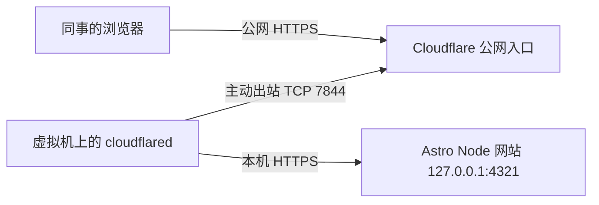

# 将虚拟机上的网站临时开放给同事评审

记录日期：2026-10-05。环境：Ubuntu x86_64、Proxmox 管理的虚拟机、Astro + Node 网站。

本次使用 Cloudflare Quick Tunnel，将虚拟机上运行的网站映射到公网 HTTPS 地址。用户已在自己的浏览器打开下面的链接，确认可以看到网站：

<https://pendant-actors-season-recycling.trycloudflare.com/>

这是本次运行的临时地址，不应当作为长期入口。本文记录实际成功的方法，供后续分享和复用；以下部署步骤用于重新搭建，当前服务已经运行，不需要再执行一遍。

## 1. 为什么这个方法适合当前环境

这台虚拟机由 Proxmox 管理，我们没有宿主机、路由器或端口映射的管理权限。观察到的公网 IP 是 `165.173.0.221`，但仅知道公网 IP，并不能判断外部请求能否转发到这台虚拟机的网站端口。

Cloudflare Tunnel 的连接由虚拟机主动向外建立，因此不需要配置公网入站端口映射。Quick Tunnel 可以生成随机的 `trycloudflare.com` 地址，不需要 Cloudflare 账号或自己的域名，适合临时展示和评审。[官方 Quick Tunnel 文档](https://developers.cloudflare.com/tunnel/get-started/quick-tunnels/)



浏览器请求通过已建立的隧道送到本机网站，响应沿隧道返回。网站仍然运行在这台虚拟机上。

**能访问外网 HTTPS 是一个有利条件，但不等于隧道一定可用。** 本次选择 HTTP/2，仍需要允许向 Cloudflare 隧道节点发起 TCP `7844` 连接；QUIC 使用 UDP `7844`。本机已经实际连接成功。若其他环境阻止这些出站连接，需要管理员放行。[官方网络要求](https://developers.cloudflare.com/cloudflare-one/networks/connectors/cloudflare-tunnel/configure-tunnels/tunnel-with-firewall/)

## 2. 准备工作

项目目录：`/home/ubuntu-template/china/labs/prj-nstcn/goal-run`。

需要 Node.js `>=22.12.0`、npm、curl、Python 3、OpenSSL 和 tmux。本项目依赖已经安装；新机器还需在项目目录执行 `npm ci`。

```bash
uname -m
node --version
npm --version
command -v curl python3 openssl tmux
```

本次 `uname -m` 返回 `x86_64`，因此下载 `cloudflared-linux-amd64`。如果返回 `aarch64`，需要改用 ARM64 版本。

下面步骤中的变量请在同一个终端设置并使用：

```bash
PROJECT_DIR=/home/ubuntu-template/china/labs/prj-nstcn/goal-run
RUN_DIR="$HOME/.local/state/nexstack-review"
BIN_DIR="$HOME/.local/bin"
mkdir -p "$RUN_DIR" "$BIN_DIR"
```

## 3. 安装 cloudflared，不需要 sudo

本次安装位置是 `~/.local/bin/cloudflared`，实际版本为 `2026.9.3`。下面的示例从官方最新发布中读取 Linux AMD64 资产，下载后核对官方 SHA-256，再赋予执行权限。以后运行时版本可能不同。[官方发布页面](https://github.com/cloudflare/cloudflared/releases/latest)

```bash
python3 - "$BIN_DIR/cloudflared" <<'PY'
import hashlib
import json
import os
import sys
import urllib.request

headers = {"User-Agent": "cloudflared-review-setup"}
api = "https://api.github.com/repos/cloudflare/cloudflared/releases/latest"
with urllib.request.urlopen(urllib.request.Request(api, headers=headers)) as r:
    release = json.load(r)
asset = next(a for a in release["assets"] if a["name"] == "cloudflared-linux-amd64")
expected = asset.get("digest", "")
if not expected.startswith("sha256:"):
    raise SystemExit("官方资产没有 SHA-256 digest，请先人工核对发布信息。")
with urllib.request.urlopen(urllib.request.Request(asset["browser_download_url"], headers=headers)) as r:
    data = r.read()
actual = "sha256:" + hashlib.sha256(data).hexdigest()
if actual != expected:
    raise SystemExit("SHA-256 校验失败，停止安装。")
with open(sys.argv[1], "wb") as f:
    f.write(data)
os.chmod(sys.argv[1], 0o755)
print("已安装并校验：", release["tag_name"], sys.argv[1])
PY

"$BIN_DIR/cloudflared" --version
```

这里始终使用完整路径，不依赖 `~/.local/bin` 是否已经加入 `PATH`。

## 4. 为本项目准备本机 HTTPS

普通静态页面通常可以直接使用官方示例 `cloudflared tunnel --url http://localhost:8080`。本项目的联系表单会检查请求的 `Origin`，实际使用的 Node 适配器又根据本机连接判断 HTTP/HTTPS。

如果公网是 HTTPS、本机回源是 HTTP，两边协议可能不一致，导致正常提交被同源检查拒绝。因此本次让隧道通过 HTTPS 访问本机 Node 服务，保留原有的同源检查。

```bash
(
    umask 077
    openssl req -x509 -newkey rsa:2048 -sha256 -nodes \
      -keyout "$RUN_DIR/origin.key" \
      -out "$RUN_DIR/origin.crt" \
      -days 30 -subj '/CN=localhost' \
      -addext 'subjectAltName=DNS:localhost,IP:127.0.0.1'
)
```

这份自签名证书仅用于 `cloudflared → 本机网站`。浏览器看到的是 Cloudflare 公网 HTTPS 证书。隧道通过指定证书信任本机服务，无需关闭证书校验。Astro Node 适配器支持通过 `SERVER_KEY_PATH` 和 `SERVER_CERT_PATH` 启用 HTTPS。[Astro 官方说明](https://docs.astro.build/en/guides/integrations-guide/node/)

## 5. 启动隧道，取得临时公网地址

创建启动脚本，并用 tmux 在后台运行：

```bash
cat > "$RUN_DIR/start-tunnel.sh" <<EOF
#!/bin/bash
exec "$BIN_DIR/cloudflared" tunnel --no-autoupdate --protocol http2 \\
  --url https://localhost:4321 \\
  --origin-ca-pool "$RUN_DIR/origin.crt" \\
  --origin-server-name localhost \\
  --logfile "$RUN_DIR/tunnel-https.log"
EOF
chmod 700 "$RUN_DIR/start-tunnel.sh"
tmux new-session -d -s nexstack-review-tunnel "$RUN_DIR/start-tunnel.sh"
tail -n 40 "$RUN_DIR/tunnel-https.log"
```

日志会给出一个 `https://随机名称.trycloudflare.com` 地址，并在连接成功后出现隧道注册信息。先记下地址，再进行下一步。此时网站尚未启动，访问出现 `502` 属于预期情况。

本机已经存在 `nexstack-review-tunnel` 会话时，不要重复创建同名会话。可以通过 `tmux ls` 查看现有会话。

## 6. 用公网地址构建并启动网站

把下面的地址替换为上一步获得的地址。本次成功的地址如下：

```bash
PUBLIC_ORIGIN=https://pendant-actors-season-recycling.trycloudflare.com
cd "$PROJECT_DIR"
SITE_ENV=review SITE_ORIGIN="$PUBLIC_ORIGIN" npm run build
```

构建时设置 `SITE_ORIGIN`，是为了让 canonical、站点地图等生成内容使用正确的公网地址。`SITE_ENV=review` 保留评审环境的禁止索引设置。

创建网站启动脚本：

```bash
cat > "$RUN_DIR/start-web.sh" <<EOF
#!/bin/bash
set -e
cd "$PROJECT_DIR"
export SITE_ENV=review
export SITE_ORIGIN="$PUBLIC_ORIGIN"
export HOST=127.0.0.1
export PORT=4321
export SERVER_KEY_PATH="$RUN_DIR/origin.key"
export SERVER_CERT_PATH="$RUN_DIR/origin.crt"
exec node --env-file-if-exists=.env dist/server/entry.mjs >> "$RUN_DIR/web.log" 2>&1
EOF
chmod 700 "$RUN_DIR/start-web.sh"
tmux new-session -d -s nexstack-review-web "$RUN_DIR/start-web.sh"
```

网站只监听本机 `127.0.0.1:4321`，公网访问经过隧道。脚本通过运行时变量覆盖网站地址，不需要修改或分享包含邮件配置的 `.env`。私钥和运行日志放在用户状态目录，不提交到项目仓库。

## 7. 验证并分享

```bash
tmux ls
ss -ltnp 'sport = :4321'
curl --cacert "$RUN_DIR/origin.crt" -I https://localhost:4321/
curl -I "$PUBLIC_ORIGIN/"
```

检查本机 HTTPS 和公网地址均能返回正常响应，再用自己的电脑或手机打开公网链接。请同时检查首页、内容页面、移动端布局、联系表单以及图片和样式。

本次验证结果：

- 26 个页面的公网检查通过，包含预期的 404 页面；重定向、canonical 和禁止索引设置符合评审环境要求。
- 桌面及移动端浏览器检查通过，联系表单的必填校验正常；错误来源的请求被拒绝。
- 项目 15 项自动测试通过；此次部署验证未向外部邮箱发送真实邮件。
- 用户已从自己的浏览器打开公网链接，确认看到网站。

可以把当前链接直接发给同事评审。这个部署没有启用登录或访问名单，任何获得链接的人都能访问；`noindex` 和 `robots.txt` 不等于访问控制。[Quick Tunnel 的公开访问说明](https://developers.cloudflare.com/tunnel/get-started/quick-tunnels/)

## 8. 日常查看、停止和重新启动

查看日志：

```bash
tail -n 80 "$HOME/.local/state/nexstack-review/web.log"
tail -n 80 "$HOME/.local/state/nexstack-review/tunnel-https.log"
tmux ls
```

tmux 会话可以在 SSH 断开后继续运行。需要进入会话时执行 `tmux attach -t nexstack-review-tunnel`；退出查看而保留运行，按 `Ctrl+B`，松开后按 `D`。这些会话不会在虚拟机重启后自动恢复。

评审结束，停止本次的两个服务：

```bash
tmux kill-session -t nexstack-review-tunnel
tmux kill-session -t nexstack-review-web
ss -ltnp 'sport = :4321'
```

停止隧道后，临时公网地址失效。重新创建 Quick Tunnel 会产生新地址，需要更新网站启动脚本里的 `SITE_ORIGIN`，按第 6 步重新构建并启动网站，再把新链接发给同事。[临时地址生命周期](https://developers.cloudflare.com/tunnel/get-started/quick-tunnels/)

如果只重启网站、原有隧道进程仍然运行，继续使用当前地址即可。本机证书有效期为 30 天，持续使用超过有效期时，需要重新生成证书，并重启网站和隧道使新证书生效。

## 9. 常见问题与后续选择

| 现象 | 排查方向 |
| --- | --- |
| `cloudflared: command not found` | 使用 `~/.local/bin/cloudflared` 完整路径，检查安装是否成功。 |
| 隧道一直无法连接 | 查看日志，确认出站 TCP 7844 可以访问 Cloudflare；仅能访问 HTTPS 443 不足以证明可用。 |
| 公网返回 502 | 查看网站日志和 4321 监听状态，核对 HTTPS、证书路径和隧道回源地址。 |
| 页面正常但表单被同源校验拒绝 | 核对本机 HTTPS 是否启用，以及公网地址、运行时 `SITE_ORIGIN` 是否一致。 |
| 本机证书报错 | 检查有效期、`localhost` 名称及 `--origin-ca-pool` 路径；不要直接关闭证书校验。 |
| 页面引用旧域名 | 用新的 `SITE_ORIGIN` 重新构建，更新启动脚本并重启网站。 |
| 重启虚拟机后无法访问 | tmux 不提供开机自启动，重新启动隧道并按新地址构建网站。 |

Quick Tunnel 适合临时评审，不提供可用性保证，最多支持 200 个并发在途请求，并且不支持 SSE。需要长期固定地址时，可以改用 Cloudflare 账号、域名和命名隧道，再按需要配置访问控制及服务自动启动。[官方限制说明](https://developers.cloudflare.com/tunnel/get-started/quick-tunnels/)

本次经验的关键是：先验证虚拟机能建立出站隧道，再让网站的构建地址、运行地址和回源协议保持一致。这样即使无法管理 Proxmox 或公网入站端口，也能将本机网站临时提供给同事评审。
